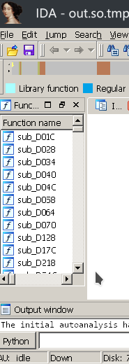
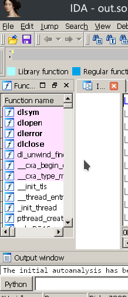

Elf-Fix-Memory-Dumper
====
[](https://github.com/Anonym0usWork1221/Memory-Dumper/stargazers)
[](https://github.com/Anonym0usWork1221/Memory-Dumper/network/members)
[](https://github.com/Anonym0usWork1221/Memory-Dumper/issues)
[](https://github.com/Anonym0usWork1221/Memory-Dumper/watchers)
[](https://www.python.org)
[](https://www.cpp.org)
[](https://www.c.org)
[](https://opensource.org/licenses/)


-----------


**This is a script for Dumping Run Time Memory with elf fixer**

If you find any bug or not working functions you can contact me. 

 *  Author : Abdul Moez
 *  Version : 0.2
 *  Study  : UnderGraduate in GCU Lahore, Pakistan
 *  Repo  : (https://github.com/Anonym0usWork1221/Memory-Dumper)
 
 MIT License

 Copyright (c) 2022 AbdulMoez


# Version 0.2
    -> Optimized the code
    -> Update the MemoryTool to 0.4 androidmemorytool support
    -> Reduce complexity of installation
    -> Update the setup.py and remove errors of installation
    -> Disable logs so clean output can be seen
    -> Patch the fix.cpp file (to reduce logs and errors)
    
System & Env Requirements
-----------
* Needed python version 3.6+
* Android Requirements -> Rooted Device Needed

Installation on termux
----------------------------------------
* **__Installation__**  
  ```
  pkg update && pkg upgrade  
  pkg install cmake
  pkg install tsu  
  pkg install python3  
  pkg install git
  git clone https://github.com/Anonym0usWork1221/Memory-Dumper  
  cd Memory-Dumper/
  pip3 install .
  ```      
* **__Dumped lib will be appeared in same directory__** ``./dumped_lib/*`` 

Installation on Linux
----------------------------------------
* **__Installation__**  
  ```
  apt install cmake
  git clone https://github.com/Anonym0usWork1221/Memory-Dumper
  cd Memory-Dumper/    
  pip3 install .
  ```

* **__Dumped lib will be appeared in same directory__** ``./dumped_lib/*``  


Usage 
----------------------------------------
* **__Run Game/Process__**

* **__Run Script on Linux__**  
    ``python3 MemoryDumper.py``  
    
* **__Run Script on Android__**  
    ``sudo python3 MemoryDumper.py``

* **__Make your choice from given menu__**  

# Compare between no-fix and fixed ELF



Reference
----------
* [Android-MemoryTool](https://github.com/Anonym0usWork1221/android-memorytool)
* [Elf-Dump-Fixer](https://github.com/maiyao1988/elf-dump-fix)


# Contributor 

<a href = "https://github.com/Anonym0usWork1221/Memory-Dumper/graphs/contributors">
  
</a>


Assistance
----------
If you need assistance, you can ask for help on my mailing list:

* Email      : abdulmoez123456789@gmail.com

I also created a Discord group:

* Server     : https://discord.gg/RMNcqzmt9f


Buy Me a coffee
--------------
If you want to support me you can buy me coffee.
BitCoin_addr: ``` 19vwfRXfthPY7f2aqDBpxQvZa6AJFKcdBS ```
